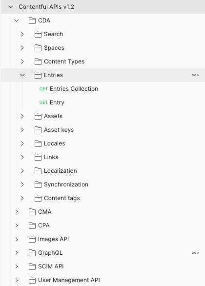

# Contentful API's schemas
openAPI, Postman and Insomnia JSON schema for contentful REST and GraphQL APIs.

* Content Delivery API (CDA) used to retrieve published content to display in your application
* Content Management API (CMA) used to create or update your content
* Content Preview API (CPA) used to retrieve content that is still unpublished
* SCIMP API System for Cross-domain Identity Management API
* Images API used to retrieve and apply transformations to images
* GraphQL Content API used to retrieve both published and unpublished content using GraphQL

## Includes

JSON endpoints definition and environment schema.



## openAPI
please use 'https://editor.swagger.io/' to edit online

to generate documentation please use: 
https://openapi-generator.tech/docs/usage

```
$ openapi-generator generate -i Contentful-CDA.openapi_collection.yml -g dynamic-html -o ctf_CDA_html/
```
## postman

## insomnia

## How to use
1. Import `Contentful APIs.postman_collection.json` into postman.
2. Import `Contentful-API.postman_environment.json`into postman.
3. Open Environments and add your CONTENFUL `space_id`, `environment_id`, `cda_access_token`, `cpa_access_token`, `cma_access_token`.

* `space_id` - Your space ID
* `organization_id` - Your orgnazitaion ID
* `cda_access_token` - Content Delivery API (CDA) access token
* `cpa_access_token` - Content Preview API (CDA)
* `cma_access_token` - Content management API (CDA)
* `personal_access_token` - Personal access token

## References and links

[Personal access tokens](https://www.contentful.com/help/personal-access-tokens/)

[API's detail documentation](https://www.contentful.com/developers/docs/references/)
