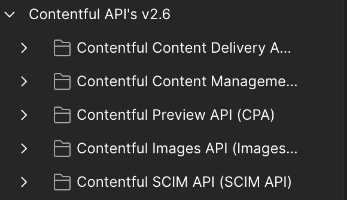

# Contentful Client API schemas

## Description

Repository containing Contentful APIs definition schemas for different clients: 

* Postman
* openAPI (Not mantained)
* Insomnia (Not mantained)

The Contentful APIs schemas include: 

* [Content Delivery API (CDA)](https://www.contentful.com/developers/docs/references/content-delivery-api/) used to retrieve published content to display in your application.
* [Content Management API (CMA)](https://www.contentful.com/developers/docs/references/content-management-api/) used to create or update your content.
* [Content Preview API (CPA)](https://www.contentful.com/developers/docs/references/content-preview-api/) used to retrieve content that is still unpublished
* [SCIMP API](https://www.contentful.com/developers/docs/references/scim-api/) used to programatically manage organization memberships and teams
* [Images API](https://www.contentful.com/developers/docs/references/images-api/) used to retrieve and apply transformations to images

## Postman installation

Import the API schema and Environment into your Postman client:

[Postman API schema json](https://raw.githubusercontent.com/rodrigo-contentful/apis-schemas/master/postman/Contentful_cda_cpa_cma_gql_images_scim_postman.json)

[Postman API environment variables](https://raw.githubusercontent.com/rodrigo-contentful/apis-schemas/master/postman/Contentful-API.postman_environment.json)

Update your local environment with your corresponding Contentful credentials and Ids.

* `space_id` - Your space ID
* `organization_id` - Your orgnazitaion ID
* `cda_access_token` - Content Delivery API (CDA) access token
* `cpa_access_token` - Content Preview API (CDA)
* `cma_access_token` - Content management API (CDA)

## Postman Usage

After import, all APIs are organized in folders with similar structure as Contentful documentation.

### Contentful Apis documentation

The import includes basic API description based on Contentful documentation.

### References and links

[Personal access tokens](https://www.contentful.com/help/personal-access-tokens/)

[API's detail documentation](https://www.contentful.com/developers/docs/references/)
